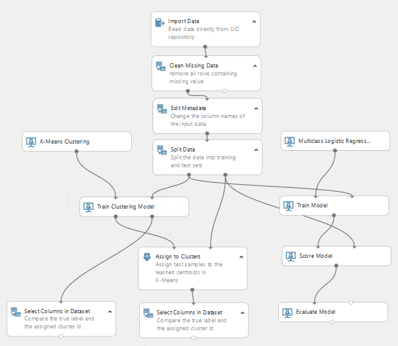

# Image clustering using Python and Azure Machine Learning Studio #
These are the steps that we will follow to accomplish our mission:
- Understanding what image clustering is and what we need to do to achieve it
- Selecting a dataset
- Image preprocessing with Python
- Clustering with Azure ML Studio
- Conclusion and results

## Understanding what image clustering is and what we need to do to achieve it ##
So yes, we want to cluster images but why and how should be our main questions before any coding begins.
### Why? ###
Image clustering could be useful when we have a large dataset of images and we want to identify patterns within them, there are different examples:
- Can I cluster these car images into different car brands or colors?
- Can I cluster these x-ray photos to identify potential anomalies?
- Can I cluster a set of people faces to identify emotions on their expressions?
- Can I cluster these flowers to identify different species or different growth states between a same flower?

As you can see the opportunies are endless and all we'll need to do is to preprocess such images before applying AI into them. 

>NOTE. For simplicity purposes we'll use the terms AI, Machine Learning (ML) and Deep Learning as if they were the same altough they are not. But for our current task here we won't need to settle down and understand their differences.

In our current repo we'll try to answer this question: *Can a Machine Learning model grab a flower picture and determine if the flower is a rose or a dandelion?*

Spoiler alert? Yes, it can.
### How? ###
Now that we know our purpose it's time to determine how we will do it. We need to pre process our images in such a way that our ML model is able to diggest it to first be trained and then start to 'classify' new images arriving.

>NOTE. We'll cover some basic Machine Learning topics so if you're a medium-advanced user you might jump straight to Image preprocessing with Python and/or Clustering with Azure ML Studio

### New to data science? ###
We'll try to run a quick Data Science 101 here:
- Any data science project needs a business question to be answered
- Once we have it, we need to look for a big dataset available to answer such question
- We'll split the dataset into a training and a test set, sometimes we'll even have a validation set.
- Why split the data? Because we'll use ~80% of it to train a machine learning model (training set) and the remaining 20% to test the trained model with unseen data and see if its accurate and precise
- Once the data is split we'll use it to train multiple ML algorithms and check the results to see which algorithm works best of us
- Depending on the results obtained there's a chance we'll need to use different algorithms or do some parameter tuning on the ones that got the best performance
- Finally, we'll draw conclusions from our results and determine if we are happy with what we'be obtained or we'll need more data, use different algorithms, have a different approach, etc.

### Understanding labels and features ###
Most Machine Learning models take datasets that contain a set of features and a single label per every data entry. Then, for each entry the model grabs those features and makes calculations to try to predict the original label.

So, we could think of things like:
- Number of petals
- Color of flower
- Size of plant
- Number of leafs
- Diameter of flower, etc

as features, and our label would be the already identified type of flower:

<table>
<tr>
<td>Type</td>
<td># of leafs</td>
<td># of petals</td>
<td>Color</td>
</tr>
<tr>
<td>Rose</td>
<td>6</td>
<td>28</td>
<td>Red</td>
</tr>
<tr>
<td>Dandelion</td>
<td>4</td>
<td>6</td>
<td>Yellow</td>
</tr>
<tr>
<td>Rose</td>
<td>5</td>
<td>24</td>
<td>White</td>
</tr>
<tr>
<td>...</td>
<td>...</td>
<td>...</td>
<td>...</td>
</tr>
<td>Rose</td>
<td>7</td>
<td>32</td>
<td>Red</td>
</table>

**Our first column in the table above is our label and the rest are features**

### Supervised vs unsupervised learning ###
When we have a label to start the we are talking about a classification problem and thus we'll use 'supervised learning' algorithms such as Decision Trees, Two-class Bayes Point Machine, and others.
When we don't have (or don't want to use) an initial label then we'll need to use 'unsupervised learning' algorithms, K-Means clustering being one of the most used.
#### Why would we ignore the label? ####
In some cases we might want to validate our dataset and for that we'll use clustering algorithms first. If the clustering model gives us a same number of labels then that *should* mean our labels are good.

### Converting an image to a set of features and labels ###
If ML models take labels and features, then we'll need to convert our image into that. What type of approach could we take?
- We could look at each image and create a csv file containing color, number of leafs, color of the flower, calculate the diameter of the flower and turn this into a classification problem
- Or we could convert the image into an array of features where each feature is a pixel of the image and face a clustering problem

Let's take the second approach.

Imagine you have a 2px x 2px color image:


If each of those squares above represent a pixel then we could represent our image as a two dimension array in python:
```python
image = [ 
[pixel, pixel],
[pixel, pixel]
]
```
But let's remember that a pixel has 3 numeric values that represent their red, green and blue values (RGB), so we'll have a three dimension array:
```python
image = [
[ [1,2,3], [4,5,6] ],
[ [7,8,9], [0,1,2] ]
]
```
So, a 2px x 2px image has in fact 12 numeric features representing each color of every pixel. We could use those 12 features and train a clustering model with them and see what clusters we'll get in return.

## Selecting the dataset ##
We'll use the [Flower color images](https://www.kaggle.com/olgabelitskaya/flower-color-images) dataset from [Olga Belitskaya](https://www.kaggle.com/olgabelitskaya) found in [Kaggle.com](https://www.kaggle.com/).

>TIP: If you are new in Data Science, Kaggle.com is THE place to go for finding datasets, experiments and challenges from one of the biggest data science communities in the web. 

### Analizing the dataset ###
There are 210 images and all of them have 128px x 128px, so that means that per each image we'll have 49152 feautures (remember the RGB values of each pixel)

Since we have 210 images we'll take 80% of them (168) and put them into a folder called **trainingSet** and the remaining 20% (42) pictures will go into a folder called **testSet**.

#### Are 210 images enough? ####
Most of the times they are not but there are good algorithms that can make classification and clustering happen with just around a couple of images, however most algorithms take datasets of thousands of samples to have a proper training.
#### Is it important that the images have the same pixel size? ####
It is! Remeber that each pixel with its 3 color values will represent a feauture for our algorithms. If we had a 128x128 image and then another one of 128x156 pixels the difference between them in terms of features would be huge:
- First image = 128x128x3 = 49152
- Second image = 128x156x3 = 59904 features

Think of it, there's a difference of 10752 features between them. If we would write a csv file with features as columns per each image that would mean the 128x128 image will have 10752 blank features and when our models are training those blank features would make a whole difference. Even if the image is the exact same but on a different resolution.

#### What could be done standardize the image sizes? ####
The first step would be to ensure our dataset have similar, if not same, sizes for every image. If this isn't possible because the images were taken with different cameras, on different zooming levels, etc then we could write some scripts to change the size of all the images to a standard size

## Image preprocessing with Python ##
### Change size of images ###
Thankfully, the images in our dataset have the same size, but if you need to change sizes to your own dataset here' a quick script in python for this task:

```python
import numpy as np
from PIL import Image
import os

rootdirs = ['./trainingSet/','./testSet/']
resizedFolder = ['./resizedTrainingSet/','./resizedTestSet/']
os.makedirs(resizedFolder[0])
os.makedirs(resizedFolder[1])
i=0
j=0
myDirs = []
for x in rootdirs:
    for subdir, dirs, files in os.walk(x):
        for file in files:
            i=i+1
            im = Image.open(x+file)
            imResize = im.resize((128,128), Image.ANTIALIAS)
            imResize.save(resizedFolder[j]+ str(i)+'.png', 'PNG', quality=90)
        j=j+1
```
### Understanding the resizing script ###
The script above asumes you already have 2 folders called **trainingSet** and **testSet** with your data split in a training and a test set. Once the script runs it will create two new folders called **resizedTrainingSet** and **resizedTestSet**.

Per every image found in the original training and test folders the script will open an image, change the size to 128 x 128 pixels and save it to its respective training or test new resized folder. 
 
The code can be found in the [code folder](https://github.com/JorgeCupi/ImageClusteringUsingAzureMLStudio/tree/master/code) at the root directory of this repo. If you have JPEG files then just change the extension in the line 18 of the code.

### Turning our images into a CSV file ###
Recall we have to represent our image as an array of its pixel color values:
```python
image = [
[ [1,2,3], [4,5,6] ],
[ [7,8,9], [0,1,2] ]
]
```
to 

```python
image = [ [1,2,3], [4,5,6], [7,8,9], [0,1,2] ]
```
to
```python
flatImage = [1,2,3,4,5,6,7,8,9,0,1,2]
```

Thankfully, doing this is as easy as it gets in Python:
```python
flatImage = image.flatten()
```
That's it! We have to this to every image in our training and test set folders. We could also aditionally add a label column (the dataset has a separate csv file with the names of every flower) before creating our csv files with labels and features.

#### Opening the csv file with the original labels ####
Given that we've already split our data into training and testing:
- We'll duplicate our "flower-labels" csv file and have training and a test versions, the first file containing the first 168 labels and the second one containing the remaining 42 labels. 
- We'll also remove the first row as it just contains text specifying that column A belongs to the image name and that column B contains the label assigned to it.
- To have more 'meaningful' results we'll also replace the numeric values of the labels to the flower names (the names can be found in the dataset original link in Kaggle)

In short we'll go from here:


to here:


Remember we now have two csv files: *testLabels.csv* and *trainingLabels.csv*

To open both files we simply need code like this:
```python
import csv
labels = []
fileTraining = open('trainingLabels.csv')
reader = csv.reader(fileTraining)
trainingLabels = list(reader)
labels.append(trainingLabels)
fileTest = open('testLabels.csv')
reader = csv.reader(fileTest)
testLabels = list(reader)
labels.append(testLabels)
```


#### Creating our csv file ####
After flatenning our images to 1 dimension arrays we'll also add a first column containing the labels we have obtained from our csv files with similar code like this:

```python
flatImage[:0] = 'Label obtained from the CSV files'
```
We'll have to iterate over our test and training set folders to do this flattening process and create a single array containing all our flatten images:
```python
images= []
images.append[flatImageOne]
images.append[flatImageTwo]
# lots of appends later
images.append[flatImageN]
```

Once we have that array we'll finally create two CSV files for our training and test dataset respectively:
```python
with open("fileName.csv", "wb") as f: 
    writer = csv.writer(f)
    writer.writerows(imagenes)
```

Don't worry, here's a complete version of the code:
```python
import numpy as np
import csv
from PIL import Image
import os
import csv

rootdir = ['./trainingSet/','./testSet/']
csvFiles = ['trainingSet.csv','testSet.csv']

labels = []
fileTraining = open('trainingLabels.csv')
reader = csv.reader(fileTraining)
trainingLabels = list(reader)
labels.append(trainingLabels)
fileTest = open('testLabels.csv')
reader = csv.reader(fileTest)
testLabels = list(reader)
labels.append(testLabels)

j=0
k=0
finalArray = []
for directory in rootdir:
    currentLabels = labels[k]
    for subdir, dirs, files in os.walk(directory):
        for file in files:
            fileName = subdir+file
            myImage = np.array(Image.open(fileName))
            myArray = myImage.flatten()
            imageArray = myArray.tolist()
            imageArray[:0]=[currentLabels[j]]
            finalArray.append(imageArray)
            j = j + 1
        print(directory+ " images flat proccess completed")

        with open(csvFiles[k], "wb") as f: 
            writer = csv.writer(f)
            writer.writerows(finalArray)
        print(csvFiles[k]+ " written successfully")
        finalArray = []
        j = 0
        k = k + 1
```
### Understaning the flattening process and array to csv file script ###
Basically, the script above: 
- Grabs our **trainingSet** and **testSet** folders to iterate over them
- But before the iteration takes place it reads our two label csv files, reads them and converts them into two arrays
- Then those two arrays are elements of a bigger array named **labels**
- Once the iteration begins the script opens one folder at a time and also loads the corresponding label array into a new array called **currentLabels**
- Then, one image at a time, it flattens them and adds them to a list called **imageArray**
- After the flatenning process, it grabs the corresponding label value from the **currentLabels** array and puts it as the first column of our array **imageArray**
- Then a final array called **finalArray** adds the newly flattened and labeled image 
- Once all the images from a given folder have been added to the **finalArray** array then we write a csv file

You can find the script from above in the **toCSV.py** file located in the [code folder](https://github.com/JorgeCupi/ImageClusteringUsingAzureMLStudio/tree/master/code) from this repo.

## Clustering with Azure ML Studio ##
### Uploading our dataset ###
Now that we have our dataset (both training and test) ready we'll upload them to [Azure Machine Learning Studio](https://studio.azureml.net/) using our Microsoft Account. Once we have signed in we just click on the **+New** button on the bottom left side of the page. We must do this for both our datasets and when we're doing it we should select the **Generic CSV file with no header** option at the **Select a type for the new dataset** option:


### Using an existing K-Means project in ML Studio ###
Once our files have been uploaded we'll create a new experiment by clicking the **+New** button again except that this time we'll select the **Experiment** option and we'll type **Iris** or **clustering** in the search bar:


Then we'll put the mouse pointer over the Iris experiment and click on **Open in Studio** option to see how the next modules are being loaded:



### Cleaning the project and adding our datasets ###
We can delete the first 4 modules from our model:
- Import data
- Clean missing data
- Edit metadata
- Split data


We won't need a split data module because we already did this with manually and created to datasets using Python: our training and test datasets. We also don't need a cleaning module since we know our data is clean. Now, we just have to add our datasets and indeed we'll add a new Edit Metadata module to set our first column as a label:


### Understanding K-Means ###
Before using K-Means we should understand how it works. Without entering into deep math and statistic details, K-Means is a popular unsupervised learning algorithm that is useful for scenarios like:
- Anomaly detection
- Data clustering
- Analysis of datasets prior to use of classification or regression algorithms.

K-Means has this clustering capabilities thanks to the use of [Lloyd's Algorithm](https://en.wikipedia.org/wiki/Lloyd's_algorithm) that measures the distances between the features of our datasets and creates centroids that will group our data depending on the distances calculated. At the beginning of the algorithm these centroids are given a random position and their position changes as the distance calculation occurs.

The algorithm ends when the centroids positions stabilize (meaning that the positions stopped changing even with new data arriving) or if the number of iterations defined have already occured.

### Setting up K-Means in Azure ML ###
If we click on the [K-Means](https://msdn.microsoft.com/en-us/library/azure/dn905944.aspx) module in our experiment we'll notice we are able to modify the next parameters:
- **Create trainer mode**: Defines if we know what features we want to use for the clustering or if we will use all or a range of them. We'll choose **Single parameter**
- **Number of centroids**: Defines the number of starter centroids for our algorithm. We'll choose 9 (This doesn't mean that the model will exactly output 9 clusters, the number will increase or decrease according the the distance calculation of our features)
- **Initialization**: Defines the K-means algorithm that will be used for the experiment. We'll use the standard **K-means++** algorithm
- **Random number seed**: Optional parameter to determine the initial seeding for our clustering algorithm.
- **Metric**: It's the function that we'll use to measure the distance between our features. We'll choose **Cosine**
- **Iterations**: Defines the number of iterations(epochs) that our algorithm will run during its training. We'll use **200**
- **Assign label column**: Allows us to define if we want to ignore the Label column or if we want to use it to improve the clustering

### Setting up and understanding Multiclass Logistic Regression ###
We'll use **K-Means** to cluster our flower images but at the same time we'll leverage the [Multiclass Logistic Regression](https://msdn.microsoft.com/en-us/library/azure/dn905853.aspx) module to make some benchmarking. This regression module is very popular in the supervised learning algorithms field and allow us to predict multiple label based on a already labeled dataset.

If we select its module in our experiment we'll see the next parameters:
- **Create trainer mode**: Same as K-Means, defines if we know what features we want to use for the clustering or if we will use all or a range of them. We'll choose **Single parameter**. Note that if we weren't sure of which parameters to use we could leverage modules like [Tune Model Hyperparameters](https://msdn.microsoft.com/en-us/library/azure/dn905810.aspx) so a ML model helps us determine the best features for our regression model.
- **Optimization tolerance**: Determines a numeric value for optimization convergence. If the improvement between iterations es less that this value then the model will finish its training. We'll put a minimum value like **1E-07**
- **L1 and L2 regularization weight**: They are recommended to be greater than 0 and are useful to prevent overfitting by penalizing the model with high coeficient values. We'll put a value of **1** in both
- **Memory size for L-BGFS**: Determines the memory size to be used by the algorithm. L-BFGS stands for **Limited memory Broyden-Fletcher-Goldfarb-Shanno
- **Random number seed**: Defines the seeding initialization
- **Allow unknown catergorical levels**: Option that allows us to create a **unknown** element in each categorical feature

### Setting up the Train Clustering Model and Train Model ###
If we click on our **Train Clustering Model** module we'll see that it has an option to launch a column selector. Once that screen is launched we'll configure the selector in such a way that the model will exclude the Label column by excluding the column with name **Col1**:


>NOTE: ML Studio generates names for our columns since our datasets arrived with no names. That's why our label its in the column **Col1**

On the other hand, at the **Train Model** module we'll also launch the column selector but this time we'll ask it to explicitly select **Col1** as our label since the Multiclass Classification Regression algorithm needs a label to work with. 

### Assign to Cluster and Score model modules ###
These are the modules where we put our test datasets and use them against our trained modules:
- **Assign to cluster** receives the results from the **K-Means** module
- **Score model** takes the results from the **Multiclass** module

Both modules receive the **test Dataset** as a second parameter.

## Results ##
### K-Means results ###
We can find our results in the **Select columns in dataset** module below the **Assign to Cluster** module that picked just the Label column (named **Col1**) and a new column generated by the trained K-Means module called **Assignments**

If we click on the **Visualize** option located at the bottom of the **Select columns in dataset** we'll find the next:


The results are abysmal. Our K-Means clustering model barely identified 2 clusters called 1 and 0. We can see some trends:
- Bellflower, Peony, Leucanthemum and Rudbec we're mostly classified as **0**
- Viola, Rose and Aquilegia were classified as **1**

No matter the trend, such poor results leads us to several questions but before adressing them lets see the results from Multiclass.

### Multiclass results ###
Located in the **Evaluate Model** module we can observe the following:


Not as bad as the K-Means results but these results are nowhere decent. There's an average accuracy of 86% but barely 33% of precision. 

## Conclusions and next steps ##
No matter how we look at these results. We have poor performance and it could be because of multiple factors:
- Dataset is too small
- The K-Means and Multiclass algorithms are not the best at handling images
- The K-Means and Multiclass algorithms are not the best at handling small datasets (in terms of samples quantity, not features quantity)

In a future update on this post we'll see what happens if we use a larger dataset with the same algorithms